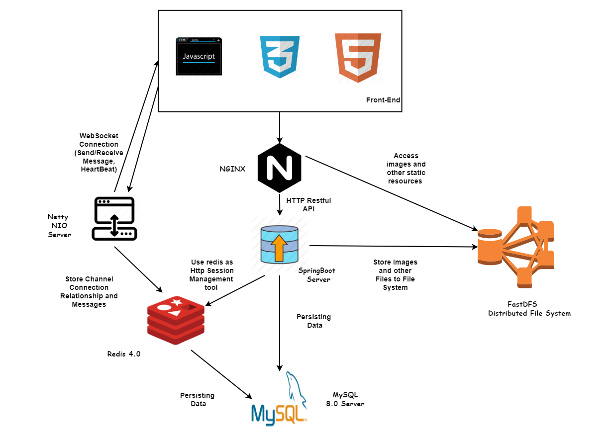
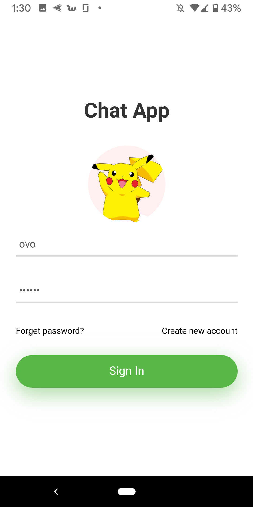
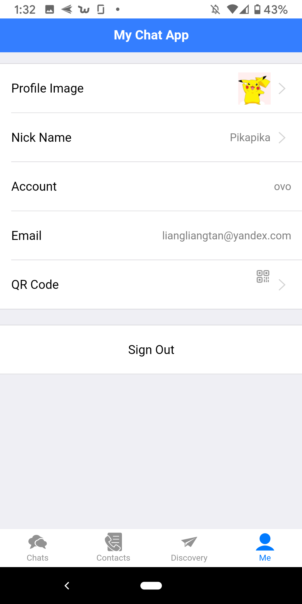
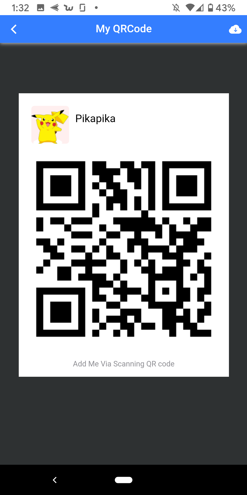
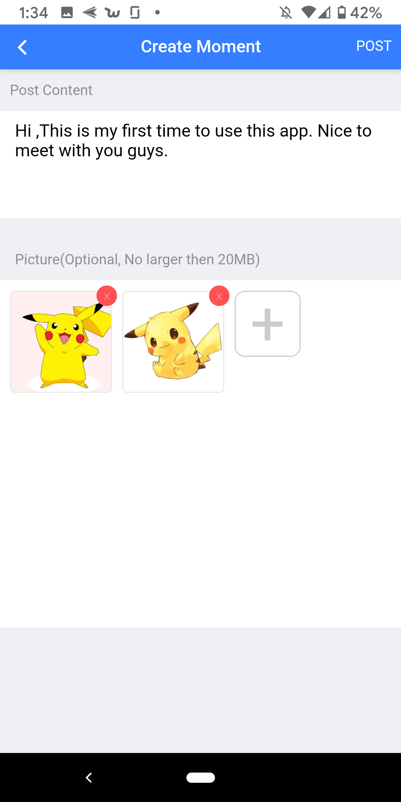
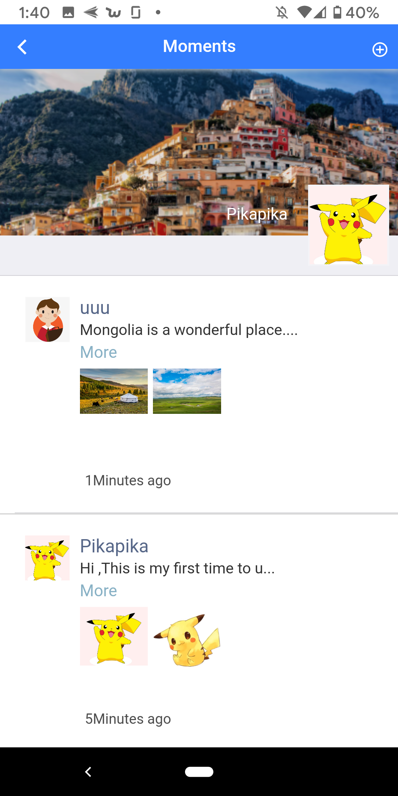
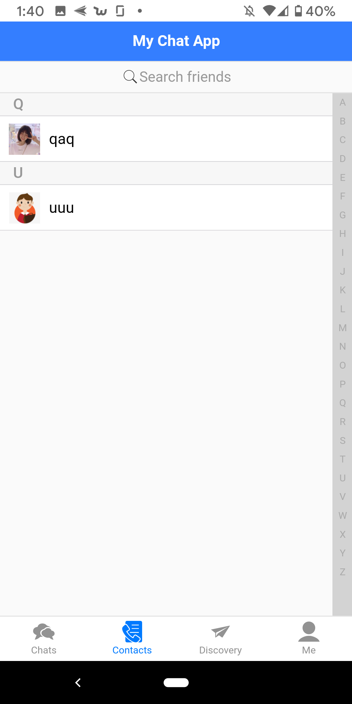
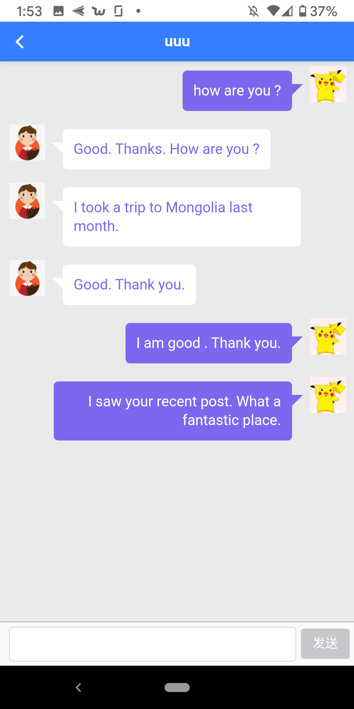
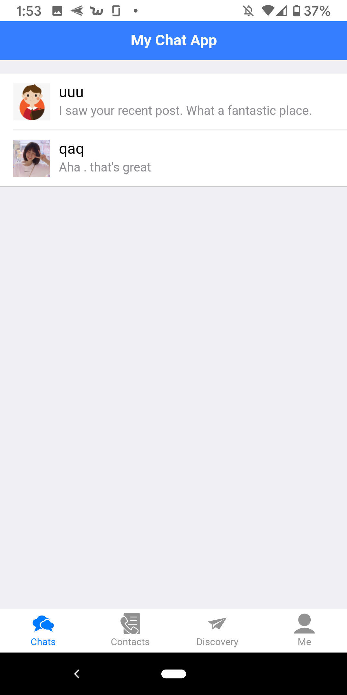

# A-Chat-Netty-built-on-Netty
**A Full stack Project Built with Netty,Spring/SpringBoot as back-end, JavaScript(ES5) + html+ css as front-end**


## Overview
1. Built the back-end web architecture via **SpringBoot**.
2. Built the WebSocket Server with **Netty NIO** for instant messaging exchange.
3. Deployed Distributed File System(**FastDFS**) on Cloud Virtual Machine Instances for images storage and backups.
4. Deployed **NGINX** on VM Instance as a reverse proxy server for back-end services.
5. Designed schemes abd created database on **MySQL Server 8.0**, and utilizeda **MyBatis** as a ORM framework to interact with the SQL Server.
6. Utilized **Redis** for HTTP session caching to improve the speed of retrieving and storing client information in sessions, it is also been used to associate online clients with netty channels. 
7. Utilized **ZXing("Zebra Crossing") BarCode Scanning library** for generating QR Code per user for the convenience of searching and adding users. 
8. Utilized **Ajax** to realize the asynchronous communication between frond-end and back-end. 
9. Performed unit test by **JUnit Test** on back-end services, and tested **REST API** via **PostMan**.
10. Developed **Front-end (Mobile End)** by MUI Mobile Framework, using **HTML**, **CSS**, **JavaScript(ES5)**
11. Utilized **Cropper.js** to crop uploaded images and avatars.
12. Utilized **PhotoSwipe.js** to display images in posts.
13. Improved the security by introducing Symmetric Encryption Algorithms like **DES** for QR code and message encryption and Asymmetric Encryption Algorithms like **MD5** for password encryption. 


## Project Snapshot

1. **Project architecture**:
<div>
  
</div>
<br> 

---

1. **Login Page**:

<div>
  
</div>
<br> 

---
3. **Account Page**:
   
<div>
  
</div>
<br> 


---

4. **QR Code Page**:
   
<div>
  
</div>
<br> 


---
5. **Posts  pages**

*Create/Edit a Post*
<div>
  
</div>
<br> 

*Display posts*
<div>
  
</div>
<br> 


---
6. **Contact  page**

<div>
  
</div>
<br> 


---
7. **Chat Pages**

*Chat page andhistory*
<div>
  
</div>
<br> 

*Chat SnapShot*
<div>
  
</div>
<br> 

---

## Getting Started

- Clone the project 
```
git clone https://github.com/liangliangliangtan/A-Chat-App-Built-On-Netty.git
```
- Go to the project folder and import it as a maven project in `eclipse` or `IntelliJ IDEA`.
- Install [fastDFS](https://github.com/happyfish100/fastdfs) on you System.(I use CentOs 6.9)
- APK for the front-end will be uploaded later. 


## Maven Project Structure


```
├───.mvn
│   └───wrapper
├───src
│   ├───main
│   │   ├───java
│   │   │   └───com
│   │   │       └───example
│   │   │           └───mychatappnetty
│   │   │               ├───configuration
│   │   │               ├───controller
│   │   │               ├───dao
│   │   │               ├───entity
│   │   │               │   └───dto
│   │   │               │       ├───bo
│   │   │               │       └───vo
│   │   │               ├───enums
│   │   │               ├───netty
│   │   │               │   └───entity
│   │   │               ├───redis
│   │   │               ├───service
│   │   │               │   └───impl
│   │   │               └───util
│   │   └───resources
│   │       └───mapper
│   └───test
│       └───java
│           └───com
│               └───example
│                   └───mychatappnetty
│                       ├───controller
│                       ├───dao
│                       ├───service
│                       │   └───impl
│                       └───util
```
---

### Dependencies

* dependencies can be viewed in pom.xml 


---
### TODO List:

There are many things which can be improved further.

- [ ] Message Push Notification
- [ ] Like/ Comment Posts
- [ ] Voice Chat. 
- [ ] Refactor the Front-Eend by Ionic


